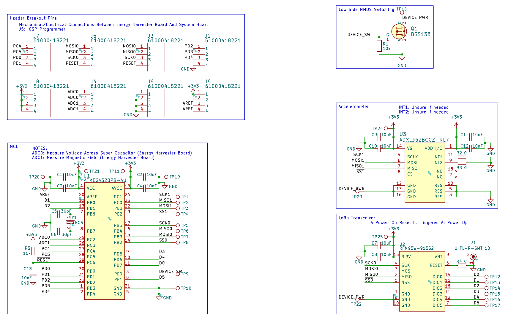

# Foresight Processing

## Overview
The processing board is responsible for the main processing of the vibration analysis. On board is the ATmega328pb microcontroller, RFM95W LoRa transceiver and ADXL362 accelerometer. In addition there is a NMOS low side switch to turn of the RFM95W and ADXL362 when they are not needed to save power consumption.

## Table of Contents

- [Hardware Setup](#hardware-setup)
- [Imporant Notice](#important-notice)

### Hardware Setup

### Important Notice
- All required components used in this project can be located in the components folder. 
- To add these components into your workspace please follow the instructions from given from each of the individual components. 
- Ensure the digikey submodule is initialise and follow the README to set this up.

## Authors
- Nathan Nguyen